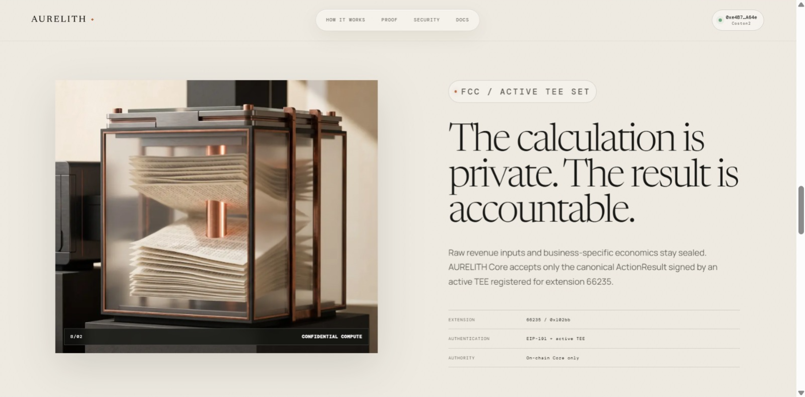
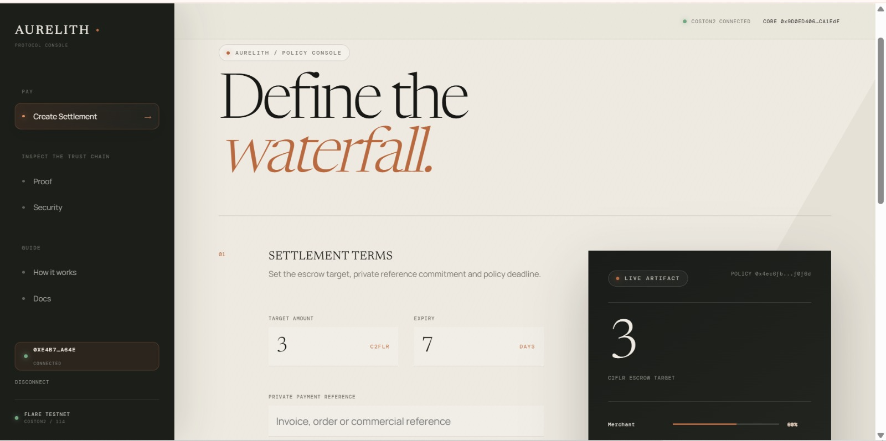
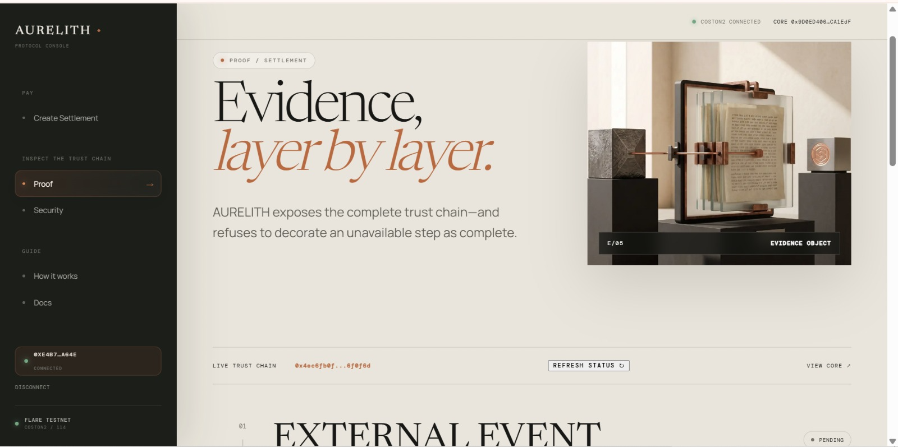
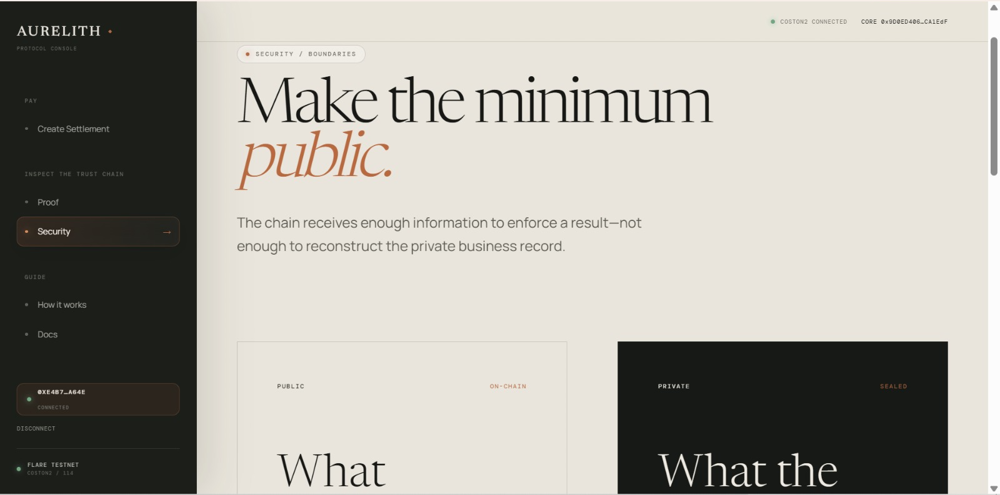
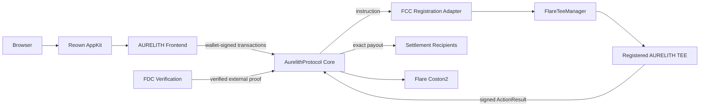
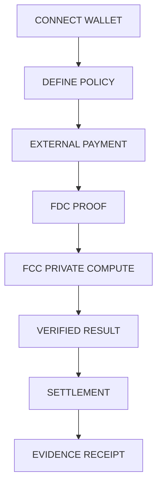

# AURELITH

<p align="center"><strong>Private programmable settlement infrastructure on Flare.</strong></p>

<p align="center">
  
  
  
  
</p>

<p align="center"></p>

> **Prove the payment. Keep the economics private. Settle only the verified result.**

AURELITH lets a business commit a multi-recipient revenue policy, verify an external payment through Flare Data Connector, evaluate sensitive commercial rules through Flare Confidential Compute, and release the authenticated result exactly once on Coston2.

The payment evidence may be public. Customer records, deductions, margins and partner economics do not need to be.

---

## The problem

Multi-party revenue settlement usually forces a bad choice: expose the commercial ledger to every recipient, or ask recipients to trust an operator-controlled calculation. Screenshots and private spreadsheets cannot prove that an external payment occurred, that the right rule was applied, or that the payout was not replayed.

## The solution

AURELITH binds six things into one contract-enforced lifecycle:

```text
POLICY -> EXTERNAL PROOF -> PRIVATE COMPUTE -> AUTHENTICATED RESULT -> SETTLEMENT -> RECEIPT
```

- Ordered recipients and shares are committed before computation.
- Native C2FLR is held by the Core rather than a browser or off-chain operator.
- FDC verifies the referenced external transaction.
- FCC evaluates sealed commercial inputs and returns a canonical ActionResult.
- Core authenticates the signer against the active TEE set for extension `66235`.
- Proof, result, nonce, expiry and settlement replay protections are enforced on-chain.

## Why AURELITH

AURELITH is not a single affiliate calculator or a frontend escrow. It is a reusable private settlement rail for marketplace splits, creator revenue, partner commissions, royalties, milestone pools and compatible business obligations.

Its differentiation is programmable, versioned, multi-recipient settlement where external evidence and confidential computation jointly authorize the exact payout vector.

## Live demonstration

The Core and FCC registration adapter are deployed on Coston2. A complete policy lifecycle has been executed with real Coston2 transactions: policy creation, 1 C2FLR funding, FDC request submission, voting-round finalization, DA proof retrieval, on-chain proof verification, FCC instruction execution, active-TEE ActionResult authentication and final multi-recipient settlement.

The completed policy is `0xc9009d55516e0bcb07cfd9335353194bf6f6205ec7b689ba684089cf2dac4455`. Its full machine-readable request bytes, DA response, Merkle proof, FCC ActionResult, signatures and receipts are recorded in [`contracts/deployments/coston2-lifecycle.json`](contracts/deployments/coston2-lifecycle.json).

## Product screenshots

The product screenshot captures are shown below:

| Accountability Details | Seettlement Dashboard |
|:---:|:---:|
|  |  |
| **Proof Dashboard** | **Security Dashboard** |
|  |  |

## Live links

| Resource | URL | Purpose |
|---|---|---|
| Live Demo | [https://aurelith-one.vercel.app/](https://aurelith-one.vercel.app/) | AURELITH frontend and protocol console |
| Video Demo | [Youtube](https://youtu.be/bL49q5EYiUw?si=808c8lvU16J_OMvJ) | AURELITH video Presentation |
| GitHub repository | [github.com/0xkinno/aurelith](https://github.com/0xkinno/aurelith) | Source, contracts and documentation |
| Coston2 explorer | [coston2-explorer.flare.network](https://coston2-explorer.flare.network) | Contract and transaction evidence |
| Flare Developer Hub | [dev.flare.network](https://dev.flare.network) | Official FDC, FCC and network documentation |

## Deployed contracts

| Contract | Address | Network | Explorer |
|---|---|---|---|
| AurelithProtocol Core | `0x9D0ED40615845ee6134F475AcCF35e0412CA1EdF` | Coston2 / 114 | [Open](https://coston2-explorer.flare.network/address/0x9D0ED40615845ee6134F475AcCF35e0412CA1EdF) |
| AurelithFccInstructionSender | `0xFa34633c12e5A93166FAA0E54A3D50Fd62Ae8D49` | Coston2 / 114 | [Open](https://coston2-explorer.flare.network/address/0xFa34633c12e5A93166FAA0E54A3D50Fd62Ae8D49) |
| FlareTeeManager | `0x1a9C4A0f9D76c0b1D91d22E24E573a9b377618aE` | Coston2 / 114 | [Open](https://coston2-explorer.flare.network/address/0x1a9C4A0f9D76c0b1D91d22E24E573a9b377618aE) |
| FdcVerification | `0x906507E0B64bcD494Db73bd0459d1C667e14B933` | Coston2 / 114 | [Open](https://coston2-explorer.flare.network/address/0x906507E0B64bcD494Db73bd0459d1C667e14B933) |

`AurelithFccInstructionSender` is the minimum bytecode-bearing adapter required by the official FCC registration lifecycle. It cannot hold policy funds, authenticate results, allocate payouts, refund or settle.

## Transaction evidence

| Action | Transaction | Explorer | Status |
|---|---|---|---|
| Deploy Core | `0x1da42ef3577d01e1416eb8118e17c94f2e1ddc4e103a0a88ba92fc4e0d825355` | [Open](https://coston2-explorer.flare.network/tx/0x1da42ef3577d01e1416eb8118e17c94f2e1ddc4e103a0a88ba92fc4e0d825355) | CONFIRMED |
| Deploy FCC adapter | `0x05a21548e40221e892ce7e76a2e7c37b1afb56452715d8bad97f059ed0bc475d` | [Open](https://coston2-explorer.flare.network/tx/0x05a21548e40221e892ce7e76a2e7c37b1afb56452715d8bad97f059ed0bc475d) | CONFIRMED |
| Bind Core to active TEE set | `0x252deb4a89a73d9015cbcdbf0dcf9066fbb2713e0248fdeb3e9b7328d265a92c` | [Open](https://coston2-explorer.flare.network/tx/0x252deb4a89a73d9015cbcdbf0dcf9066fbb2713e0248fdeb3e9b7328d265a92c) | CONFIRMED |
| Resolve adapter extension | `0xc0c207ce61acba8fd8978f21a2059223d80b0e3cd7e6d1a1357e909cecaa1676` | [Open](https://coston2-explorer.flare.network/tx/0xc0c207ce61acba8fd8978f21a2059223d80b0e3cd7e6d1a1357e909cecaa1676) | CONFIRMED |
| FCC extension registration | `0xe6919d1adece13f32ba39cf9e4ed4e77f13f3acba32411822df9246caed2ab9f` | [Open](https://coston2-explorer.flare.network/tx/0xe6919d1adece13f32ba39cf9e4ed4e77f13f3acba32411822df9246caed2ab9f) | CONFIRMED |
| Create demonstration policy | `0xa1c15ee68e4f25b555223d5be66e6bb579c0e3d281961f22ce5a5b5ee61a99c6` | [Open](https://coston2-explorer.flare.network/tx/0xa1c15ee68e4f25b555223d5be66e6bb579c0e3d281961f22ce5a5b5ee61a99c6) | CONFIRMED |
| Fund policy with 1 C2FLR | `0x95cf3216d8e0b8bec5c8fd5c8a79d59e6ea8db609bcc2496062ac68ca12291ed` | [Open](https://coston2-explorer.flare.network/tx/0x95cf3216d8e0b8bec5c8fd5c8a79d59e6ea8db609bcc2496062ac68ca12291ed) | CONFIRMED |
| Submit FDC attestation request | `0xa51aa842a2617b1f2a06b025cf59f32185e8827830b2097927031eaa57a2dc10` | [Open](https://coston2-explorer.flare.network/tx/0xa51aa842a2617b1f2a06b025cf59f32185e8827830b2097927031eaa57a2dc10) | CONFIRMED |
| Bind FDC request to policy | `0xdd7c8ec502e35c263bc5a5c28a48369954019c2b6702cc05c68bc2dcc4a761e0` | [Open](https://coston2-explorer.flare.network/tx/0xdd7c8ec502e35c263bc5a5c28a48369954019c2b6702cc05c68bc2dcc4a761e0) | CONFIRMED |
| Verify DA proof in Core | `0xd4276d7becfaa4bcaad2ec14bcafeab87ca269c1b0dd310fce4f7aef496ef6ad` | [Open](https://coston2-explorer.flare.network/tx/0xd4276d7becfaa4bcaad2ec14bcafeab87ca269c1b0dd310fce4f7aef496ef6ad) | CONFIRMED |
| Send FCC settlement instruction | `0xf2bed9f712f228a58172f45629993e8220a00ef18f3100aeb2a97fd8f4c54281` | [Open](https://coston2-explorer.flare.network/tx/0xf2bed9f712f228a58172f45629993e8220a00ef18f3100aeb2a97fd8f4c54281) | CONFIRMED |
| Authenticate FCC ActionResult | `0x12de7d276d0efc41b80030b7b43429d9bf2e55d35dd9d25908f9a2640fa50e05` | [Open](https://coston2-explorer.flare.network/tx/0x12de7d276d0efc41b80030b7b43429d9bf2e55d35dd9d25908f9a2640fa50e05) | CONFIRMED |
| Final policy settlement | `0x5f0e5fdacdb17e5bf527f49566d7230a3024dfbf3376735349a620ab003086d5` | [Open](https://coston2-explorer.flare.network/tx/0x5f0e5fdacdb17e5bf527f49566d7230a3024dfbf3376735349a620ab003086d5) | CONFIRMED |

### FDC and FCC evidence identifiers

| Evidence | Verified value |
|---|---|
| FDC source transaction | `0x95cf3216d8e0b8bec5c8fd5c8a79d59e6ea8db609bcc2496062ac68ca12291ed` |
| Source block / timestamp | `34056731` / `2026-08-14T15:18:02.000Z` |
| Source value | `1 C2FLR` |
| FDC request reference | `0xbe3d9cf78f9854a0ff32ff7a8cf600f680ad0943bd07b0db58a710cd09e3f490` |
| FDC voting round | [`1425452`](https://coston2-systems-explorer.flare.network/voting-round/1425452?tab=fdc) |
| On-chain FDC proof digest | `0xc5ef73440f0daa6888dcadfa21df2241b1c4c19469ff9b1c72d065da309e071c` |
| FCC extension / instruction | `66235` / `0x104a8145d7147a45ee43d63884c9f2d41e2a4b4b14dc68c80d6940f73afd0d21` |
| Private-input commitment | `0x62a48a613842f0599d2a30eefd8bf21b6b5c0192c56d937ee6ab67a1fc4c3c5b` |
| Authenticated result digest | `0xf8c35a2bd559c697893fccbd11b3054f57c78dce39abbb3c0ee0f66c170a48df` |
| Final settled amount | `1 C2FLR` across the committed `60% / 20% / 10% / 10%` allocation |

## Architecture

```text
+----------------------- BROWSER ------------------------+
| Reown AppKit -> wagmi / viem -> AURELITH Frontend      |
+-----------------------------+--------------------------+
                              |
                 real wallet signatures / reads
                              |
                              v
+-------------------- FLARE COSTON2 ----------------------+
|                                                       |
|  FDC Verification --------> AurelithProtocol Core     |
|                                  |                    |
|                                  | FCC instruction    |
|                                  v                    |
|                       FCC Registration Adapter         |
|                                  |                    |
|                                  v                    |
|                          FlareTeeManager               |
|                                  |                    |
|                                  v                    |
|                      Registered AURELITH TEE           |
|                                  |                    |
|                          signed ActionResult           |
|                                  |                    |
|                                  v                    |
|  Settlement recipients <--- exact Core payout vector |
+-------------------------------------------------------+
```



## End-to-end usage flow



## Protocol lifecycle

```text
DRAFT
  -> FUNDED
  -> PROOF_REQUESTED
  -> PROOF_VERIFIED
  -> COMPUTATION_REQUESTED
  -> RESULT_AUTHENTICATED
  -> READY_TO_SETTLE
  -> SETTLED

Recovery: CANCELLED -> REFUNDED
Expiry: unsettled funded policy -> REFUNDED
Terminal negative outcome: NO_SETTLEMENT_DUE
```

Core rejects duplicate proofs, duplicate results, settlement twice, expired requests, invalid participants, unauthorized actions, malformed proof/result data, wrong recipients and wrong totals.

## FDC integration

AURELITH uses the official Coston2 `FdcVerification` contract for an `EVMTransaction` proof. The completed demonstration prepared a `testFLR` request through the official verifier, submitted it to the dynamically resolved `FdcHub`, finalized in voting round `1425452`, retrieved the raw response and Merkle proof from Flare's DA layer, and verified that proof in Core.

The attested source is the confirmed 1 C2FLR policy-funding transaction. The original policy-creation transaction transferred zero value and was therefore not used as settlement evidence. This distinction is enforced by Core's proof-value requirement.

## FCC integration

- Extension ID: `66235` / `0x102bb`
- Active development TEE: `0xca183535EfE09a97616b385d4F8334e35F088887`
- `SIMULATED_TEE=true`
- `LOCAL_MODE=false`
- Chain, registration, proxy routing and transactions: real Coston2

The Core hashes the canonical ActionResult, applies the EIP-191 envelope, recovers the signer and checks that the signer belongs to the active TEE set for the registered extension. The FCC adapter has no settlement authority.

## TEE and private compute

The local development path simulates the hardware-attestation layer only. It does not simulate the Coston2 chain, extension registration, instruction routing, ActionResult signature or on-chain verification.

Private commercial inputs remain outside public contract storage. The public result contains only the policy/proof/input commitments, exact recipients and payouts, nonce, expiry and authenticated result material needed for enforcement.

## Security model

- Policy owner authorization for lifecycle actions.
- Immutable ordered recipient binding.
- Exact share total of 10,000 BPS.
- Proof/result digest replay protection.
- Monotonic per-policy result nonce.
- Chain ID, policy, computation reference and expiry binding.
- Canonical EIP-191 result authentication.
- Active TEE membership verification.
- Checks-effects-interactions and reentrancy protection.
- No arbitrary owner drain or unrestricted approval path.

See [SECURITY.md](docs/SECURITY.md) and [PROTOCOL-SPEC.md](docs/PROTOCOL-SPEC.md).

## Failure modes

AURELITH distinguishes user rejection, wrong network, insufficient gas, RPC failure, transaction revert, unavailable proof infrastructure, expired policy, cancellation/refund and terminal settlement. Infrastructure uncertainty never becomes a successful business outcome.

See [FAILURE-MODES.md](docs/FAILURE-MODES.md).

## Frontend architecture

The Next.js App Router frontend uses Reown AppKit, wagmi and viem. The ABI is generated from the compiled `AurelithProtocol` artifact, and transaction success is displayed only after an actual receipt.

The flagship interface includes:

- Editorial protocol landing experience.
- Cinematic four-stage lifecycle.
- Honest evidence timeline.
- Public/private security paper.
- GitHub-linked documentation library.
- Real policy creation workspace with live local commitments.
- Explicit wallet, network and transaction states.

## Technology stack

| Layer | Technology |
|---|---|
| Frontend | Next.js 15, React 19, TypeScript |
| Wallet | Reown AppKit, wagmi, viem |
| Contracts | Solidity 0.8.28, Hardhat, OpenZeppelin |
| Network | Flare Coston2, chain ID 114 |
| External proof | Flare Data Connector |
| Confidential compute | Flare Confidential Compute extension scaffold |
| FCC runtime | Docker, Redis, ext-proxy, extension-tee, MySQL indexer |

## Environment variables

| Variable | Exposure | Purpose |
|---|---|---|
| `NEXT_PUBLIC_REOWN_PROJECT_ID` | Public browser configuration | Reown AppKit project identifier |
| `NEXT_PUBLIC_AURELITH_CONTRACT_ADDRESS` | Public | Deployed Core address |
| `NEXT_PUBLIC_AURELITH_FCC_SENDER_ADDRESS` | Public | FCC adapter address |
| `NEXT_PUBLIC_COSTON2_RPC_URL` | Public | Coston2 JSON-RPC |
| `DEPLOYER_PRIVATE_KEY` | Server/deployment only | Testnet deployment signer |
| `FCC_INDEXER_USERNAME` | Server only | Authorized FCC indexer login |
| `FCC_INDEXER_PASSWORD` | Server only | Authorized FCC indexer password |
| `FCC_EXT_PROXY_URL` | Server/runtime | Public extension proxy route |
| `VERIFIER_API_KEY_TESTNET` | Server only | Official FDC testnet verifier credential |

Never expose credentials through `NEXT_PUBLIC_*`, source code, screenshots or browser logs.

## Local setup

Requirements: Node.js 20+, npm, and Ubuntu/WSL Docker for the FCC runtime.

```bash
npm install
cp .env.example .env.local
npm run contract:compile
npm run dev
```

Open [http://localhost:3000](http://localhost:3000).

For FCC runtime details, use [FCC-RUNBOOK.md](docs/FCC-RUNBOOK.md). The Ubuntu/WSL Docker services must remain running while processing local FCC instructions.

## Test commands

```bash
npm test
npm run contract:gate
npm run build

cd fcc-extension/typescript
npm test
npm run typecheck
```

## Deployment

Deployment is gated by compilation, unit/security/integration tests, generated ABI validation, official dependency bytecode checks and deployer C2FLR balance.

```bash
npm run deploy:coston2
```

The two application-owned contracts are already deployed. Do not redeploy unless a genuine contract defect or intentional version upgrade is documented.

## Verification and evidence

- Machine-readable manifest: [`contracts/deployments/coston2.json`](contracts/deployments/coston2.json)
- Protocol specification: [`docs/PROTOCOL-SPEC.md`](docs/PROTOCOL-SPEC.md)
- Flare integration: [`docs/FLARE-INTEGRATION.md`](docs/FLARE-INTEGRATION.md)
- Build audit: [`docs/BUILD-AUDIT.md`](docs/BUILD-AUDIT.md)
- Competitive audit: maintained locally and intentionally gitignored

## Competition positioning

AURELITH targets the Flare Summer Signal Confidential Compute Apps direction. Its differentiated capability is programmable private multi-party settlement: verified external evidence plus authenticated confidential computation authorizes a bound payout vector exactly once.

It does not add unrelated RFQ, auction, slashing or cross-chain features merely to imitate another project.

## Testnet and deployment status

AURELITH is currently deployed and demonstrated on Flare Coston2 testnet. This deployment is intentionally configured for testnet evaluation and does not represent a production-funds deployment.

Before mainnet use, AURELITH would require the normal production-readiness process: independent security review and audit, production FCC/TEE infrastructure, persistent hosted execution services, operational monitoring, and mainnet-specific FDC and network configuration.

Current testnet considerations:

- The Coston2 deployment is testnet-scoped and has not yet received an independent smart-contract audit.
- The current FCC environment uses the available testnet execution path and must not be interpreted as a production hardware-security boundary.
- A production deployment would use production-grade FCC/TEE infrastructure instead of the local simulated-development TEE environment.
- Continued creation of new FDC attestations depends on access to the official testnet verifier service and its authorized testnet credential.
- The frontend can be hosted independently from the local development environment.
- A persistent FCC execution environment and stable public proxy are recommended for continuous live demonstrations. The same lifecycle remains reproducible from the documented runbook and on-chain evidence.
- C2FLR and all associated network infrastructure are testnet resources used solely for demonstration and evaluation.
- The four final product screenshots should be captured from the real rendered interface; they are intentionally not fabricated in this repository.

## License

MIT License. See [`LICENSE`](LICENSE).

---

Built for Flare Summer Signal. Every displayed protocol state is intended to correspond to real wallet, chain, proof or FCC evidence.